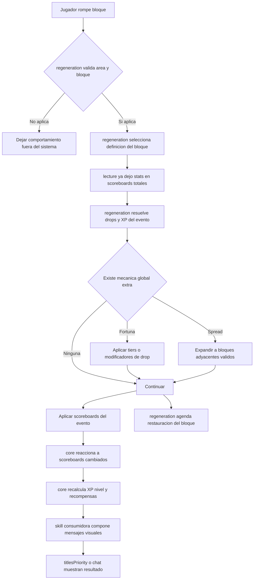

# Migracion a Core de Skills

> Minecraft Bedrock 1.21.132 · BP/RP Atomic-3 · Documento de migracion

Este documento reemplaza la antigua nota de trabajo `foraging/Foraging.md`.

Su objetivo ya no es describir solamente la skill de tala, sino servir como guia de migracion para reestructurar `skills/` alrededor de un `core/` reutilizable, manteniendo a `foraging/` como primer consumidor fuerte del nuevo modelo.

---

## 1. Objetivo

Reestructurar `Atomic BP/scripts/features/skills/` para que las skills que comparten el mismo patron de progreso no repliquen logica de XP, nivel, recompensas, titulos, scoreboards ni acoplamientos innecesarios.

La meta es introducir un `skills/core/` que concentre contratos comunes y dejar a cada skill con responsabilidad especifica:

- `lecture/`: leer lore, sumar estadisticas y escribir scoreboards por capa.
- `regeneration/`: motor global de bloques regenerables, drops, XP por evento y mecanicas de propagacion.
- `core/`: progreso compartido de skills, catalogos de niveles, reconciliacion de recompensas y helpers genericos.
- `mining/`, `foraging/`, `farming/`: configuracion, textos, recompensas y reglas particulares de cada skill.
- `fishing/` y `combat/`: quedan fuera del core comun salvo que una parte puntual pueda abstraerse de forma segura.

---

## 2. Alcance

Esta migracion cubre:

- La definicion de una arquitectura objetivo para `skills/`.
- El desacople progresivo entre `regeneration/` y `mining/`.
- La preparacion de `foraging/` para entrar como skill real, no solo como bloque de prueba.
- La estandarizacion del flujo de imports y exports entre modulos.
- La definicion del flujo compartido de una skill basada en bloques regenerables.

Esta migracion no cubre todavia:

- La implementacion completa de `foraging/`.
- La implementacion de `fishing/` dentro del mismo core.
- Cambios de gameplay no relacionados con skills.
- Refactors cosmeticos fuera de `skills/`.

---

## 3. Estado Actual

Hoy el proyecto ya tiene una base valida sobre la cual migrar:

- `scripts/main.js` ya actua como entrypoint unico del BP.
- `lecture/` ya centraliza la lectura de lore y soporta `FortTal`, `FrenTal` y `ExpTal`.
- `regeneration/` ya funciona como motor global para `mining`, `foraging` y `farming` a nivel de configuracion de bloques.
- `mining/` ya tiene un sistema real de niveles y recompensas.
- `foraging/` existe como carpeta objetivo, pero aun no como implementacion completa.
- Los scoreboards se inicializan desde `scripts/scoreboards/` mediante un catalogo central, no desde cada skill.

El principal problema actual no es falta de base, sino el acoplamiento entre piezas que ya crecieron:

- `regeneration/` todavia importa helpers especificos de `mining/` para calcular progreso visual y reaccionar a scoreboards aplicados.
- La logica de niveles vive en `mining/`, por lo que otras skills no pueden reutilizarla sin copiarla.
- `foraging/` necesita una mecanica nueva de propagacion por bloques adyacentes que deberia ser global, no local.

### 3.1 Hallazgo operativo sobre scoreboards

La migracion debe asumir como regla base lo siguiente:

- La creacion de objectives no pertenece a `skills/`.
- La fuente de verdad actual para objectives esta en `scripts/scoreboards/catalog.js`.
- La inicializacion efectiva ocurre en `scripts/scoreboards/init.js` por medio de `initAllScoreboards()`.
- Una skill puede depender de objectives, pero no debe autonomamente crearlos como comportamiento normal del modulo.

Esto importa porque al crear `core/` sera facil caer en el error de volver a llamar `world.scoreboard.addObjective()` desde un modulo de skill. Esa direccion seria incorrecta y romperia la separacion actual de responsabilidades.

### 3.2 Regla de dependencia para objectives

Toda nueva dependencia de scoreboard que aparezca en `core/`, `mining/`, `foraging/`, `farming/`, `lecture/` o `regeneration/` debe seguir este flujo:

1. Se declara en la configuracion o registro correspondiente.
2. Se expone en `scripts/scoreboards/catalog.js`.
3. Se inicializa a traves de `initAllScoreboards()`.
4. Luego puede ser leida o escrita por el modulo consumidor.

El flujo inverso no esta permitido:

- No se crea primero el objective en un modulo de skill y luego se documenta despues.
- No se agregan objectives por fallback silencioso dentro de `skills/`.
- No se deben esconder dependencias de scoreboard dentro de helpers internos que no esten reflejados en el catalogo.

---

## 4. Direccion Arquitectonica

### 4.1 Decisiones

No se unificaran todas las skills en un solo archivo.

La razon es simple:

- Reducir archivos no equivale a reducir complejidad.
- `mining`, `foraging` y `farming` comparten estructura, pero no comparten exactamente las mismas reglas.
- `fishing` y varias partes de `combat` requieren otro tipo de flujo.
- Un archivo unico generaria acoplamiento alto, imports fragiles y mayor riesgo de romper sistemas no relacionados.

La ruta correcta es:

- Mantener una carpeta por skill.
- Extraer la logica comun a `skills/core/`.
- Mantener `lecture/` y `regeneration/` como motores globales reutilizables.
- Hacer que cada skill consuma el core mediante configuracion y puntos de extension claros.

### 4.2 Estructura objetivo

```text
skills/
  MIGRACION_CORE_SKILLS.md
  Centralizacion.md
  core/
    README.md
    index.js
    config.js
    registry.js
    progression.js
    rewards.js
    titles.js
    scoreboards.js
  lecture/
    index.js
    config.js
    statRegistry.js
    loreParser.js
    equipmentReader.js
    totals.js
    scoreboard.js
  regeneration/
    index.js
    config.js
    registry.js
    modifiers.js
    drops.js
    persistence.js
    spread.js
  mining/
    index.js
    config.js
    README.md
  foraging/
    index.js
    config.js
    README.md
  farming/
    index.js
    config.js
    README.md
  fishing/
  combat/
```

---

## 5. Responsabilidad de Cada Capa

### `lecture/`

- Lee equipamiento.
- Parsea lore.
- Escribe scoreboards de capa `Equipamiento` y `Total`.
- No resuelve niveles.
- No aplica drops.
- No conoce reglas de una skill concreta.

### `regeneration/`

- Intercepta rotura de bloques.
- Valida area, bloque y skill asociada.
- Resuelve drops y XP por evento.
- Agenda regeneracion.
- Ejecuta mecanicas globales de propagacion o encadenamiento.
- No debe depender de `mining/` ni de `foraging/` para logica generica.

### `core/`

- Define el contrato comun de progreso.
- Resuelve nivel actual segun XP y requisitos.
- Calcula requerimiento al siguiente nivel.
- Reconcilia recompensas persistentes por nivel.
- Expone hooks reutilizables para reaccionar a scoreboards aplicados.
- No lee lore.
- No conoce bloques especificos.

### Skills consumidoras

- Declaran scoreboards oficiales.
- Registran catalogos de niveles.
- Definen mensajes, recompensas y nombres visuales.
- Implementan reglas especificas si no pertenecen al motor global.

### `scoreboards/`

- Construye el catalogo central de objectives del BP.
- Inicializa objectives una sola vez al cargar el mundo.
- Debe ser el unico punto normalizado para alta de nuevos scoreboards persistentes.
- No debe contener logica de gameplay de skills.
- No debe resolver drops, niveles, formulas ni comportamiento por evento.

### Matriz resumida de responsabilidad

| Capa | Puede leer scoreboards | Puede escribir scoreboards | Puede crear objectives | Puede resolver gameplay especifico |
|---|---|---|---|---|
| `scoreboards/` | Sí | Sí | Sí | No |
| `lecture/` | Sí | Sí | No | No |
| `regeneration/` | Sí | Sí | No | Sí, solo gameplay global de bloques |
| `core/` | Sí | Sí | No | Sí, solo progreso comun |
| `mining/` | Sí | Sí | No | Sí, solo reglas de mineria |
| `foraging/` | Sí | Sí | No | Sí, solo reglas de tala |
| `farming/` | Sí | Sí | No | Sí, solo reglas de cosecha |

### Verificacion de responsabilidad antes de implementar

Antes de agregar codigo nuevo en cualquier skill, debe responderse esta pregunta:

- ¿Esto describe un bloque o evento global? Entonces va a `regeneration/`.
- ¿Esto describe progreso compartido entre skills? Entonces va a `core/`.
- ¿Esto describe lectura de equipamiento y lore? Entonces va a `lecture/`.
- ¿Esto describe alta de objectives o catalogo de scoreboards? Entonces va a `scoreboards/`.
- ¿Esto describe reglas exclusivas de mineria, tala o cosecha? Entonces va a la carpeta de esa skill.

---

## 6. Caso Foraging Dentro de la Migracion

`foraging/` sera la primera skill nueva en entrar ya con la arquitectura migrada.

Su implementacion debe quedar dividida asi:

- `lecture/` consume `FortTal`, `FrenTal` y `ExpTal` desde el lore.
- `regeneration/` ejecuta drops, XP por tala y propagacion por bloques adyacentes.
- `core/` resuelve `SkillXpTala`, `SkillLvlTala`, recompensas y mensajes.
- `foraging/` define el catalogo de niveles, rewards y presentation layer de la skill.

### 6.1 Fortuna de Tala

Debe seguir el mismo principio de `Fortuna Minera`:

- Base 0: usa tier base.
- Cada tramo define un escalado probabilistico.
- La logica debe vivir en `regeneration/` y/o sus helpers de drops, no en `foraging/`.
- `foraging/` solo declara como quiere usar esa mecanica en su configuracion.

### 6.2 Frenesi de Tala

Debe convertirse en una mecanica global del motor de bloques, no en una excepcion de `foraging/`.

Regla objetivo:

- Al romper un bloque valido, se buscan vecinos ortogonales en 6 direcciones.
- Solo se encadenan bloques del mismo tipo o del mismo criterio definido por la regla.
- El avance debe comportarse como un `spread` controlado, no como una linea fija.
- Cada 100 puntos garantizan un bloque adicional.
- El residuo define probabilidad del siguiente bloque.

Formula objetivo:

$$
extras = \left\lfloor \frac{frenesi}{100} \right\rfloor + P\left(\frac{frenesi \bmod 100}{100}\right)
$$

Donde $P(x)$ representa una oportunidad probabilistica de obtener un bloque extra adicional.

Este sistema debe vivir en un helper global, por ejemplo `regeneration/spread.js`, para que pueda reutilizarse despues por `mining/` o `farming/` si aparece una mecanica equivalente.

### 6.3 Experiencia de Talado

Debe seguir el mismo modelo funcional que `mining`:

- La ganancia por evento se calcula en `regeneration/`.
- El stat de escalado se lee desde scoreboards totales.
- La progresion de nivel se resuelve en `core/`.
- La skill solo define sus thresholds, requisitos y recompensas.

---

## 7. Flujo Compartido de una Skill



### Interpretacion por skill

- `mining`: consume fortuna minera, XP minera y catalogo de niveles de mineria.
- `foraging`: consume fortuna de tala, frenesi de tala, XP de talado y catalogo de niveles de tala.
- `farming`: consume fortuna de cosecha, XP de cosecha y futuras mecanicas de mutacion o propagacion si llegan a existir.

### Dependencias del flujo

El flujo anterior depende de tres contratos previos:

- Los objectives requeridos ya existen en `scoreboards/`.
- `lecture/` ya escribio correctamente los totals consumidos por el motor.
- `core/` conoce el `skillId` y su catalogo de progresion.

Si uno de esos tres contratos no existe, la skill puede parecer funcional a primera vista pero quedara desincronizada o incompleta.

---

## 8. Importancia Critica de Imports y Exports

Este punto debe tratarse como regla de migracion obligatoria.

La IA suele fallar menos por logica de negocio que por conexiones rotas entre archivos. En esta reestructura, los imports y exports importan tanto como la logica misma.

### 8.1 Reglas obligatorias

- Cada carpeta publica debe tener un punto de entrada estable, preferentemente `index.js`.
- Los consumidores deben importar desde la API publica del modulo, no desde archivos internos salvo necesidad real.
- Si una funcion pasa de `mining/` a `core/`, todos los imports deben cambiar en el mismo cambio.
- No mezclar export default y named exports sin una regla clara del modulo.
- Si un archivo cambia de ruta, primero se actualizan imports y luego se elimina el archivo antiguo.
- Si se renombra una funcion exportada, debe buscarse todo el workspace antes de darla por migrada.
- No debe existir codigo nuevo en `regeneration/` que importe helpers especificos de `mining/` una vez iniciado el core.

### 8.2 Regla de estabilidad

Los nombres publicos deben ser predecibles y persistentes.

Ejemplos de contratos recomendados:

- `initSkillMining(config)`
- `initSkillForaging(config)`
- `initSkillFarming(config)`
- `initSkillsCore(config)`
- `getSkillNextXpRequirement(skillId, currentLevel)`
- `onSkillScoreboardsApplied(skillId, player, addsMap)`

### 8.3 Checklist de migracion para conexiones

- Buscar imports previos antes de mover cualquier helper.
- Confirmar si el export actual es named o default.
- Actualizar rutas relativas en el mismo commit o cambio local.
- Verificar `main.js` al final de cada movimiento.
- Verificar que ningun modulo importe un archivo ya eliminado.
- Revisar aliases legacy antes de borrarlos por completo.
- Verificar que todo objective nuevo usado por el codigo exista en `scoreboards/catalog.js`.
- Verificar que el modulo no intente inicializar objectives por fuera de `scoreboards/init.js`.

### 8.4 Regla para IA y cambios futuros

Cuando una IA edite esta zona del proyecto, debe asumir lo siguiente:

- No mover archivos sin revisar todos sus imports.
- No cambiar un export publico sin actualizar consumidores.
- No crear helpers duplicados si ya existe uno equivalente en `core/`, `lecture/` o `regeneration/`.
- No introducir dependencias cruzadas `mining -> foraging`, `foraging -> mining` o `farming -> mining`.
- Toda dependencia comun debe subir al `core/` o a un motor global.

---

## 9. Plan de Migracion

### Fase 1. Congelar contratos actuales

- Documentar scoreboards oficiales por skill.
- Confirmar responsabilidades actuales de `lecture/`, `regeneration/` y `mining/`.
- Mantener compatibilidad temporal con nombres legacy si todavia estan en uso.
- Auditar dependencias de scoreboard para verificar que los modulos de skills no se conviertan en creadores de objectives.

### Fase 2. Crear `skills/core/`

- Extraer logica generica de progresion desde `mining/`.
- Diseñar helpers compartidos para nivel, XP requerida, rewards y mensajes.
- Mantener wrappers temporales en `mining/` para no romper imports al inicio.
- Definir un registro formal por skill para que `core/` no hardcodee mineria como caso especial.

### Fase 3. Desacoplar `regeneration/` de `mining/`

- Reemplazar imports directos de helpers de mineria por helpers del core.
- Hacer que el progreso visual consulte el core por `skillId`.
- Evitar condicionales especiales para una sola skill cuando la regla sea compartida.
- Confirmar que `regeneration/` solo consuma objectives ya catalogados y no cree dependencias ocultas.

### Fase 4. Implementar `foraging/` sobre el core

- Crear config formal de niveles.
- Registrar recompensas y mensajes.
- Consumir `SkillXpTala` y `SkillLvlTala` desde el mismo flujo comun.
- Declarar y validar todos los objectives asociados desde `scoreboards/catalog.js` antes de integrar la skill.

### Fase 5. Introducir spread global

- Crear helper global de propagacion en `regeneration/`.
- Integrarlo primero con `foraging/`.
- Dejarlo listo para otros usos sin acoplarlo a tala exclusivamente.

### Fase 6. Normalizar documentacion

- Mantener documentos de diseno separados de contratos vigentes.
- Marcar claramente que archivos son plan, migracion o especificacion implementada.
- Evitar documentos viejos que describan una arquitectura ya superada.

---

## 10. Politica de Scoreboards para Skills

### 10.1 Fuente de verdad

Para esta migracion, la politica oficial es la siguiente:

- `scripts/scoreboards/catalog.js` define el inventario de objectives esperados por el BP.
- `scripts/scoreboards/init.js` es el responsable de materializar esos objectives en runtime.
- Los modulos de `skills/` trabajan con objectives ya existentes y catalogados.

### 10.2 Consecuencia de diseño

Si `core/` necesita un objective nuevo, ese objective no se registra dentro de `core/` como inicializacion imperativa.

Se registra primero en el catalogo central.

Esto evita varios problemas:

- Duplicacion de nombres.
- Objectives creados solo en ciertos caminos de ejecucion.
- Dependencias invisibles entre modulos.
- Fallos intermitentes cuando un sistema intenta leer antes de que otro cree el objective.

### 10.3 Riesgos a evitar

- Crear objectives desde `mining/`, `foraging/` o `farming/` por comodidad.
- Meter inicializacion de objectives dentro de callbacks de evento.
- Crear objectives solo cuando un jugador activa una feature por primera vez.
- Asumir que un fallback silencioso es una solucion valida.

### 10.4 Checklist de auditoria de dependencias

Cada vez que se agregue o mueva una dependencia de scoreboard, revisar:

1. ¿El objective ya esta declarado en `scoreboards/catalog.js`?
2. ¿El modulo solo lee o escribe, o tambien esta intentando crearlo?
3. ¿El nombre del objective es consistente con la convencion actual?
4. ¿El objective pertenece de verdad a skills o en realidad a otro sistema?
5. ¿La documentacion de la skill ya lo menciona como dependencia oficial?

### 10.5 Excepciones legacy

En el proyecto existen modulos fuera de `skills/` que aun crean objectives directamente como fallback. Eso no debe tomarse como patron para la migracion del core.

Para `skills/`, la regla objetivo sigue siendo: depender de `scoreboards/`, no reemplazarlo.

---

## 11. Casos de Usuario

La documentacion de la migracion debe contemplar al menos estos casos de uso, porque guian donde vive cada comportamiento.

### Caso 1. Jugador nuevo sin progreso

- Entra al mundo.
- Los objectives oficiales ya existen porque `scoreboards/` se inicializo primero.
- `lecture/` puede empezar a escribir stats cuando haya equipamiento valido.
- `core/` debe resolver nivel base y estado inicial sin requerir creacion dinamica de objectives.

### Caso 2. Jugador rompe un bloque valido de mining

- `regeneration/` valida area y bloque.
- Se aplican drops y XP del evento.
- `core/` recalcula nivel y rewards de mineria.
- `mining/` solo define catalogo y presentacion, no el motor completo.

### Caso 3. Jugador rompe un log valido de foraging

- `regeneration/` reconoce la skill `foraging`.
- Lee `FortTalTotalH`, `FrenTalTotalH` y `ExpTalTotalH` ya escritos previamente.
- Aplica fortuna de tala y, si corresponde, spread por frenesi.
- `core/` actualiza `SkillXpTala` y `SkillLvlTala`.
- `foraging/` compone el mensaje de progreso o recompensa.

### Caso 4. Jugador con equipo nuevo o modificado

- `lecture/` reparsea lore y actualiza scoreboards totales.
- Ni `core/` ni `regeneration/` deben reparsar lore.
- La skill consumidora usa los nuevos totals sin reimplementar lectura de stats.

### Caso 5. Administrador agrega una stat o scoreboard nuevo

- Debe registrarlo en el catalogo central de scoreboards.
- Debe actualizar la documentacion de la skill o del core.
- Debe evitar poner la inicializacion directamente dentro del modulo que lo consume.

### Caso 6. La IA mueve un helper de un modulo a otro

- Debe actualizar imports y exports en el mismo cambio.
- Debe verificar que el objetivo funcional no cambie por mover la responsabilidad.
- Debe confirmar que ninguna dependencia de scoreboard quede fuera del catalogo.

### Caso 7. Una skill futura necesita el mismo patron de progresion

- No debe copiarse `mining/` ni `foraging/`.
- Debe declararse como consumidora de `core/`.
- Solo debe aportar config, reglas y recompensas especificas.

---

## 12. Consideraciones Operativas

- No tocar sistemas fuera de `skills/` salvo imports necesarios.
- No romper scoreboards existentes por renombres apresurados.
- No borrar aliases legacy hasta verificar que no quedan consumidores.
- No mezclar la migracion del core con cambios grandes de gameplay no relacionados.
- `foraging/` debe entrar sobre una base estable, no a costa de duplicar `mining/`.
- Toda dependencia nueva de objective debe pasar por `scoreboards/` antes de usarse en skills.
- Si una responsabilidad no esta clara, primero debe resolverse en documentacion y luego en codigo.

---

## 13. Criterios de Exito

La migracion se considerara bien encaminada cuando se cumpla lo siguiente:

- `regeneration/` ya no dependa de `mining/` para comportamiento generico.
- `core/` pueda resolver progreso para mas de una skill.
- `foraging/` use el mismo motor de niveles sin copiar la implementacion de `mining/`.
- La mecanica de frenesi exista como capacidad global del motor de bloques.
- Los imports y exports de `skills/` queden estables y previsibles.
- Ninguna skill nueva dependa de crear objectives por su cuenta.
- La documentacion refleje la arquitectura real y no solo ideas sueltas.

---

## 14. Siguiente Paso Recomendado

El siguiente documento a crear o actualizar despues de esta migracion debe ser uno de estos dos:

- `skills/core/README.md` como contrato del nuevo motor compartido.
- `skills/foraging/README.md` como especificacion ya acoplada al core, con catalogo de niveles, rewards y comportamiento esperado.

Hasta entonces, este archivo debe tomarse como documento rector de la migracion de skills basada en `foraging/` pero con alcance transversal a toda la carpeta.