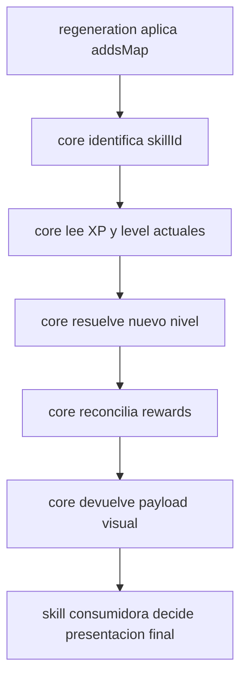

# Skills Core

> Minecraft Bedrock 1.21.132 · `@minecraft/server` 2.4.0

Documento rector del futuro `skills/core/`.

Este modulo no existe aun como implementacion completa, pero desde este punto se considera el contrato objetivo para la reestructura de `skills/`.

---

## 1. Objetivo

`core/` sera el motor compartido de progresion para las skills que comparten el patron:

- Ganancia de XP por evento.
- Resolucion de nivel por thresholds y requisitos.
- Reconciliacion de recompensas persistentes.
- Mensajeria de progreso y subida de nivel.
- API comun para integrarse con `regeneration/` y con skills consumidoras.

El objetivo es eliminar duplicacion entre `mining/`, `foraging/` y `farming/` sin colapsarlas en un unico archivo.

---

## 2. Responsabilidad del modulo

`core/` debe:

- Resolver nivel actual de una skill.
- Calcular XP requerida para el siguiente nivel.
- Reconciliar rewards por nivel de forma idempotente.
- Proveer helpers para responder a scoreboards aplicados en runtime.
- Exponer una API estable para skills consumidoras.
- Trabajar por `skillId`, no por nombres hardcodeados de mineria.

`core/` no debe:

- Leer lore.
- Interceptar rotura de bloques.
- Crear objectives de scoreboard.
- Definir drops o bloques regenerables.
- Hardcodear reglas exclusivas de una skill.

---

## 3. Dependencias oficiales

### Entrada esperada

- Objectives ya creados por `scripts/scoreboards/`.
- Eventos o scoreboards aplicados desde `regeneration/`.
- Catalogos de skill declarados por `mining/`, `foraging/` o `farming/`.

### Salida esperada

- Scoreboards de nivel actual.
- Reconciliacion de rewards persistentes.
- Payloads o hooks para titulos, chat o sistemas visuales.

### Regla de dependencia

`core/` puede depender de scoreboards, pero no puede crear objectives.

Toda nueva necesidad de objective debe registrarse antes en:

- `scripts/scoreboards/catalog.js`
- `scripts/scoreboards/init.js`

---

## 4. API publica objetivo

El modulo debe tender a una API publica predecible.

Contratos recomendados:

```js
initSkillsCore(config)
registerSkillDefinition(skillId, definition)
getSkillDefinition(skillId)
resolveSkillLevel(skillId, player)
getSkillNextXpRequirement(skillId, currentLevel)
reconcileSkillRewards(skillId, player)
onSkillScoreboardsApplied(skillId, player, addsMap)
buildSkillProgressPayload(skillId, player)
```

### Regla de exportacion

- Preferir named exports.
- Evitar mezclar `default export` y `named exports` en el mismo contrato publico.
- Exponer la API publica desde `core/index.js`.
- Evitar que consumidores importen archivos internos salvo necesidad real de implementacion.

---

## 5. Modelo de definicion por skill

Cada skill consumidora debe poder registrar un contrato declarativo similar a este:

```js
export const foragingSkillDefinition = {
  id: "foraging",
  displayName: "Tala",
  scoreboards: {
    xp: "SkillXpTala",
    level: "SkillLvlTala"
  },
  rewards: {
    primaryObjective: "FortTalPersonalH",
    perLevel: 4
  },
  levels: [
    { level: 1, xpRequired: 0 },
    { level: 2, xpRequired: 20 }
  ],
  presentation: {
    levelUpMessage: [
      "Habilidad mejorada",
      "<PreviousLevel> -> <NextLevel>"
    ]
  }
};
```

### Propiedades minimas esperadas

- `id`
- `displayName`
- `scoreboards.xp`
- `scoreboards.level`
- `levels`

### Propiedades opcionales recomendadas

- `requirements`
- `rewards`
- `presentation`
- `debug`

---

## 6. Flujo funcional esperado



---

## 7. Responsabilidades internas propuestas

### `registry.js`

- Registrar definiciones por `skillId`.
- Validar shape minimo del contrato.
- Evitar duplicados de skill.

### `progression.js`

- Resolver nivel alcanzable.
- Calcular siguiente threshold.
- Validar requirements adicionales.

### `rewards.js`

- Resolver target final de rewards por nivel.
- Corregir desincronizacion de scoreboards.
- Evitar aplicar acumulados irreversibles por evento.

### `titles.js`

- Construir payload de progreso.
- Reemplazar placeholders.
- Delegar el render real a sistemas externos como `titlesPriority` o chat.

### `scoreboards.js`

- Centralizar helpers de lectura y escritura de score.
- Compartir politicas de clamp, validacion y retry.
- No crear objectives.

---

## 8. Casos de uso

### Caso 1. Mining como skill consumidora

- `regeneration/` suma `SkillXpMineria`.
- `core/` resuelve `SkillLvlMineria`.
- `mining/` define rewards y mensaje de subida.

### Caso 2. Foraging como skill consumidora

- `regeneration/` suma `SkillXpTala`.
- `core/` resuelve `SkillLvlTala`.
- `foraging/` define rewards de tala y presentation layer.

### Caso 3. Farming como skill consumidora

- `regeneration/` suma `SkillXpCosecha`.
- `core/` resuelve `SkillLvlCosecha`.
- `farming/` define requisitos y mensajes propios.

### Caso 4. Skill futura con mismo patron

- Registra definicion declarativa.
- Usa el mismo motor de progresion.
- No copia la implementacion de otra skill.

---

## 9. Casos borde obligatorios

- Jugador nuevo con XP o nivel inexistente.
- XP negativa por error externo.
- Scoreboard configurado pero no catalogado.
- Nivel mal configurado o duplicado.
- Rewards desincronizadas respecto al nivel actual.
- Salto multiple de niveles en un solo evento.
- Bajada de XP por comando o ajuste administrativo.

---

## 10. Pruebas manuales en Minecraft

### Preparacion

- Confirmar que `initAllScoreboards()` corre antes de skills.
- Confirmar que los objectives de la skill existen en el mundo.
- Tener una zona de prueba con bloques validos para la skill.

### Validaciones de progresion

1. Jugador nuevo entra al mundo.
   Resultado esperado:
   `SkillXp* = 0` y `SkillLvl* = 1` o al baseline definido por el contrato.

2. Jugador gana XP por un evento valido.
   Resultado esperado:
   sube solo la XP correspondiente a la skill activa.

3. Jugador alcanza el threshold de nivel.
   Resultado esperado:
   `core/` recalcula nivel y reconcilia reward.

4. Jugador recibe un salto grande de XP.
   Resultado esperado:
   se calcula el nivel final maximo alcanzable, sin pasar por niveles invalidos.

5. Se reduce XP por comando.
   Resultado esperado:
   el nivel baja si corresponde y la reward persistente queda corregida.

### Validaciones de robustez

1. Desactivar temporalmente una skill en config.
   Resultado esperado:
   el core no debe romperse ni contaminar otras skills.

2. Forzar un objective faltante en catalogo durante desarrollo.
   Resultado esperado:
   se detecta error de dependencia documental, no se resuelve creando objectives desde `core/`.

3. Probar con varios jugadores simultaneos.
   Resultado esperado:
   el progreso se resuelve por jugador sin mezclar scoreboards.

---

## 11. Criterios de exito

- `mining/`, `foraging/` y `farming/` comparten el mismo motor de progreso.
- `regeneration/` deja de depender de `mining/` como caso especial.
- Ninguna skill crea objectives por su cuenta.
- La API publica del core es estable y facil de consumir.
- Las pruebas manuales en Minecraft confirman progresion consistente y sin desincronizacion.

---

## 12. Siguiente paso recomendado

Implementar primero el registro por `skillId` y los helpers de progresion del core antes de mover la skill de mineria al nuevo contrato.