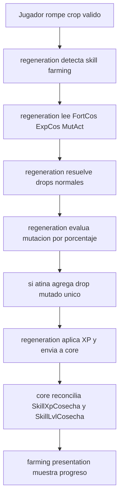

# Skill Farming

> Minecraft Bedrock 1.21.132 · Skill consumidora de core/

Este documento define a farming/ como skill de cosecha integrada al mismo patrón de mining/ y foraging/, usando los motores compartidos del proyecto.

No describe un sistema aislado. Su rol es declarar el contrato funcional y de datos para integrar farming en el repertorio de skills (excepto fishing), manteniendo compatibilidad con core/, regeneration/ y lecture/.

## Estado actual

- farming/config.js ya define scoreboards, niveles, rewards y mensajes.
- farming/index.js ya registra la skill en core/ y expone su API pública.
- regeneration/ ya reconoce farming como skill válida por skillId.
- core/ ya soporta la progresión compartida para farming.
- Los scoreboards oficiales viven en lecture/statRegistry.js y scripts/scoreboards/catalog.js.
- lecture/ normaliza Mutación Activa a escala de scoreboard 0..1000.

---

## 1. Objetivo

Integrar farming como skill de cosecha para que cada crop válido pueda:

- Dar XP de skill con su propio escalado.
- Aplicar su propia fortuna de cosecha.
- Evaluar una estadística adicional llamada Mutación Activa.
- Otorgar un drop especial único por bloque cuando Mutación Activa atina.

Regla principal de Mutación Activa:

- Es un agregado de drop, no un reemplazo del drop normal.

---

## 2. Responsabilidad de farming/

farming/ debe:

- Declarar scoreboards oficiales de XP y nivel de cosecha.
- Definir niveles, thresholds y presentation layer de la skill.
- Definir rewards persistentes de la skill.
- Consumir stats de cosecha calculadas por lecture/.
- Declarar el contrato de Mutación Activa por crop válido.

farming/ no debe:

- Leer lore directamente.
- Crear objectives de scoreboard.
- Reimplementar motores de XP, nivel o spread.
- Duplicar lógica de drops de regeneration/.

---

## 3. Dependencias oficiales

### Scoreboards de progresión

- SkillXpCosecha
- SkillLvlCosecha

### Stats de cosecha desde statRegistry

- FortCosTotalH
- ExpCosTotalH
- MutActTotalH

### Objetivos personales relacionados

- FortCosPersonalH
- MutActPersonalH

### Regla de dependencia

- farming/ consume objectives existentes.
- Ningún objective se crea desde farming/.
- Toda alta de objective nuevo pasa primero por scripts/scoreboards/catalog.js e init central.

---

## 4. Mecánicas de la skill

### 4.1 Fortuna de Cosecha

- Se consume desde FortCosTotalH.
- Modifica resultados de drops de cosecha según configuración de regeneration/.
- No reemplaza la lógica de nivel en core/.

### 4.2 Bono de XP de Cosecha

- Se consume desde ExpCosTotalH.
- Escala la XP de evento por crop válido.
- La reconciliación de nivel se resuelve en core/.

### 4.3 Mutación Activa

Mutación Activa es una probabilidad por crop válido de generar un drop especial único del bloque.

Scoreboard oficial:

- MutActTotalH

Escala numérica:

- Rango de gameplay: 0.0% a 100.0%
- Rango de scoreboard: 0 a 1000
- Ejemplo: 502 = 50.2%

Fórmula recomendada:

- mutationScore = clamp(MutActTotalH, 0, 1000)
- mutationChance = mutationScore / 1000

Resolución por evento de bloque:

- Si random(0,1) < mutationChance: se añade el drop mutado del crop.
- Si no atina: solo se aplican drops normales.

Regla obligatoria:

- El drop mutado se suma al resultado normal; nunca lo sustituye.

---

## 5. Contrato de drops mutados por crop

Cada crop válido debe declarar un drop especial único de mutación.

Ejemplo conceptual:

- zanahoria -> Zanahoria mutada
- papa -> Papa mutada
- trigo -> Espiga mutada

Contrato mínimo por bloque (diseño):

- skillId = farming
- mutación habilitada
- tabla de drop normal
- tabla de drop mutado único

Comportamiento esperado:

- Con 100.0% de Mutación Activa (1000), cada break válido añade siempre su drop mutado además del drop normal.

---

## 6. Flujo funcional



---

## 7. Contrato de configuración sugerido

```js
export const farmingSkillConfig = {
	enabled: true,

	scoreboards: {
		xp: "SkillXpCosecha",
		level: "SkillLvlCosecha"
	},

	rewards: {
		fortuneObjective: "FortCosPersonalH",
		fortunePerLevel: 4,
		mutationObjective: "MutActPersonalH"
	},

	levels: [
		{ level: 1, xpRequired: 0 },
		{ level: 2, xpRequired: 20, titleColor: "§a" },
		{ level: 3, xpRequired: 60, titleColor: "§2" }
	],

	levelUpMessage: [
		"Habilidad: <levelUpFarming>",
		"+<PreviousFortune> -> <NextFortune> de Fortuna de Cosecha",
		"<OtherAwards>"
	]
};
```

Notas del contrato:

- level 1 debe existir con xpRequired = 0.
- levels debe estar ordenado de menor a mayor.
- xpRequired no puede decrecer.
- El level up de farming incrementa únicamente Fortuna de Cosecha como reward primaria.
- Mutación Activa funciona como estadística consumida por drops mutados, no como reward automática por nivel.
- La política de rewards debe documentar si preserva máximos históricos o si reconcilia bidireccional.

---

## 8. Casos de uso

### Caso 1. Cosecha normal

- Jugador rompe un crop válido.
- Recibe drops normales y XP base/escalada.

### Caso 2. Mutación parcial

- MutActTotalH = 350 (35.0%).
- En promedio, 35 de cada 100 crops válidos añaden drop mutado.

### Caso 3. Mutación garantizada

- MutActTotalH = 1000 (100.0%).
- Cada crop válido añade su drop mutado, más su drop normal.

### Caso 4. Sin mutación

- MutActTotalH = 0.
- Nunca aparece drop mutado.

---

## 9. Casos borde obligatorios

- Crop no catalogado para farming.
- MutActTotalH negativo por corrupción externa.
- MutActTotalH por encima de 1000.
- FortCosTotalH y ExpCosTotalH en 0.
- Salto múltiple de niveles por un evento grande de XP.
- Bajada administrativa de XP o nivel por comandos.

---

## 10. Pruebas manuales en Minecraft

Preparación:

- Confirmar existencia de SkillXpCosecha y SkillLvlCosecha.
- Confirmar actualización de FortCosTotalH, ExpCosTotalH y MutActTotalH.
- Tener al menos 3 crops válidos con drop mutado único configurado.

Pruebas:

1. MutActTotalH = 0 y romper 50 crops.
	 Esperado: 0 drops mutados.

2. MutActTotalH = 1000 y romper 20 crops.
	 Esperado: 20 drops mutados (uno por evento válido) + drops normales.

3. MutActTotalH = 502 y romper 1000 crops.
	 Esperado: tasa cercana a 50.2% de eventos con drop mutado.

4. FortCosTotalH alto con MutActTotalH alto.
	 Esperado: fortuna y mutación coexisten sin anularse.

5. ExpCosTotalH alto para acelerar progresión.
	 Esperado: subida de nivel consistente vía core/, con mensajes y efectos según catálogo.

---

## 11. Criterios de aceptación

- Farming queda documentada como skill del repertorio común junto a mining y foraging.
- Se declara explícitamente Mutación Activa como estadística oficial de farming.
- La escala 0..1000 con precisión decimal de porcentaje queda formalizada.
- Se define que mutación agrega drop especial sin reemplazar drops base.
- Quedan listadas pruebas para validar comportamiento probabilístico y progresión.

