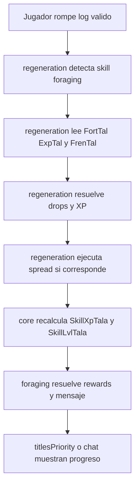

# Skill Foraging

> Minecraft Bedrock 1.21.132 · Skill operativa sobre `core/`

Este documento define a `foraging/` como skill consumidora de `skills/core/`.

No describe un sistema aislado ni una copia de `mining/`. Su rol es declarar reglas, progresion, recompensas y pruebas de la skill de tala sobre los motores compartidos del proyecto.

## Estado actual

- `foraging/config.js` ya define scoreboards, niveles, rewards y mensajes de subida.
- `foraging/index.js` ya registra la skill en `core/` y conserva una API publica simple.
- `regeneration/` ya usa la skill por `skillId` y activa spread configurable con `FrenTalTotalH` en el bloque de prueba `oak log`.
- Los objectives siguen registrandose desde `scripts/scoreboards/catalog.js`, no desde `foraging/`.

---

## 1. Objetivo

Implementar la skill de tala para que el jugador pueda ganar XP, subir niveles y recibir recompensas al romper logs validos, reutilizando:

- `lecture/` para lectura de stats desde el lore.
- `regeneration/` para drops, XP y propagacion por bloques.
- `core/` para resolver nivel, rewards y mensajes.

---

## 2. Responsabilidad de `foraging/`

`foraging/` debe:

- Declarar scoreboards oficiales de XP y nivel.
- Definir su catalogo de niveles.
- Definir rewards persistentes por nivel.
- Definir textos de notificacion y presentation layer.
- Consumir stats de tala ya calculadas por `lecture/`.

`foraging/` no debe:

- Leer lore directamente.
- Crear objectives de scoreboard.
- Implementar el motor de spread por su cuenta.
- Reimplementar el motor de progresion de `mining/`.

---

## 3. Dependencias oficiales

### Scoreboards de progresion

- `SkillXpTala`
- `SkillLvlTala`

### Scoreboards consumidos desde `lecture/`

- `FortTalTotalH`
- `FrenTalTotalH`
- `ExpTalTotalH`

### Reward principal sugerida

- `FortTalPersonalH`

### Reglas de dependencia

- Todos los objectives deben declararse en `scripts/scoreboards/catalog.js`.
- `foraging/` no puede inicializarlos por su cuenta.
- Si una reward necesita otro objective, debe pasar primero por el catalogo central.

---

## 4. Flujo funcional



---

## 5. Reglas funcionales

### 5.1 Regla base

- El jugador gana XP al romper logs validos configurados para `foraging`.
- La skill usa el mismo patron de progresion que `mining`, pero con sus propios thresholds y rewards.

### 5.2 Fortuna de Tala

- Se consume desde `FortTalTotalH`.
- Define tiers o escalado probabilistico de drops.
- Vive en `regeneration/` como mecanica global de drops.
- `foraging/` solo declara como se usa esa mecanica en su configuracion.

### 5.3 Frenesi de Tala

- Se consume desde `FrenTalTotalH`.
- No pertenece a `foraging/` como implementacion local.
- Debe usar el helper global de `regeneration/spread.js`.
- Cada 100 puntos garantizan un bloque extra.
- El residuo porcentual define oportunidad del siguiente bloque.

### 5.4 Experiencia de Talado

- Se consume desde `ExpTalTotalH`.
- Escala la ganancia de XP del evento.
- La resolucion de nivel no vive en `foraging/`; vive en `core/`.

---

## 6. Contrato de configuracion vigente

```js
export const foragingSkillConfig = {
  enabled: true,

  scoreboards: {
    xp: "SkillXpTala",
    level: "SkillLvlTala"
  },

  rewards: {
    fortuneObjective: "FortTalPersonalH",
    fortunePerLevel: 4
  },

   titleColorFallback: "§f",

   levels: [
      { level: 1, xpRequired: 0 },
      { level: 2, xpRequired: 20, titleColor: "§a" },
      { level: 3, xpRequired: 60, titleColor: "§2" }
   ],

  levelUpMessage: [
      "Habilidad: <levelUpForaging>",
      "+<PreviousFortune> -> <NextFortune> de Fortuna de Tala",
    "<OtherAwards>"
  ]
};
```

### Reglas del contrato

- `level 1` debe existir con `xpRequired = 0`.
- `levels` debe estar ordenado en ascendente.
- `xpRequired` no puede decrecer.
- Las rewards deben ser reconciliables por target, no por acumulados opacos.

---

## 7. Casos de uso

### Caso 1. Jugador tala un tronco simple

- Se detecta el bloque como `foraging`.
- Se calcula XP base.
- `core/` revisa si hay cambio de nivel.

### Caso 2. Jugador con Fortuna de Tala alta

- `regeneration/` usa tiers superiores o mejor probabilidad de drops.
- `foraging/` no toca directamente la logica de drop.

### Caso 3. Jugador con Frenesi de Tala

- Rompe un log central.
- El spread global expande la rotura a logs adyacentes validos.
- La propagacion respeta limite segun valor de frenesi.

### Caso 4. Jugador con nuevo equipamiento

- `lecture/` actualiza `FortTalTotalH`, `FrenTalTotalH` y `ExpTalTotalH`.
- `foraging/` recibe el efecto indirectamente en el siguiente evento de tala.

### Caso 5. Administrador cambia XP o nivel por comando

- `core/` debe reconciliar rewards sin dejar desincronizado `FortTalPersonalH`.

---

## 8. Casos borde obligatorios

- Jugador rompe un bloque parecido pero no catalogado como log valido.
- Jugador con `FrenTalTotalH = 0`.
- Jugador con `FrenTalTotalH = 120`.
- Jugador con `FrenTalTotalH = 400` en una linea de logs.
- Jugador con `FrenTalTotalH = 1000` en una masa compacta de logs.
- Jugador con `FortTalTotalH = 0`.
- Jugador con `FortTalTotalH` en un valor intermedio entre tiers.
- XP negativa o nivel alterado manualmente.

---

## 9. Pruebas manuales en Minecraft

### Preparacion del mundo de prueba

- Confirmar que `SkillXpTala` y `SkillLvlTala` existen.
- Confirmar que `FortTalTotalH`, `FrenTalTotalH` y `ExpTalTotalH` existen y se actualizan.
- Configurar al menos una zona de `regeneration/` con logs validos para `foraging`.

### Pruebas de drops

1. Romper un log con `FortTalTotalH = 0`.
   Resultado esperado:
   se aplica el drop base o tier inicial.

2. Romper un log con fortuna intermedia.
   Resultado esperado:
   el drop escala por probabilidad, no por duplicacion fija fuera del contrato.

3. Romper varios logs con fortuna alta.
   Resultado esperado:
   la distribucion de drops refleja tiers altos de forma consistente.

### Pruebas de spread

1. Colocar 4 logs en linea y romper el segundo con `FrenTalTotalH = 400`.
   Resultado esperado:
   el sistema puede abarcar la cadena completa respetando expansion por vecinos ortogonales.

2. Colocar una masa compacta de logs y usar `FrenTalTotalH = 1000`.
   Resultado esperado:
   la expansion forma un patron de propagacion, no una linea artificial fija.

3. Repetir con `FrenTalTotalH = 120`.
   Resultado esperado:
   se garantiza 1 bloque extra y existe 20% de opcion del siguiente.

### Pruebas de progresion

1. Empezar con jugador nuevo.
   Resultado esperado:
   `SkillXpTala = 0` y `SkillLvlTala` en el baseline configurado.

2. Ganar XP hasta el primer threshold.
   Resultado esperado:
   el nivel sube y la reward queda reconciliada.

3. Forzar un salto multiple de XP.
   Resultado esperado:
   el nivel final es el maximo valido y el mensaje muestra el resultado final.

4. Reducir XP por comando.
   Resultado esperado:
   el nivel baja si corresponde y `FortTalPersonalH` se corrige al target de ese nivel.

### Pruebas de integracion

1. Cambiar equipamiento con stats de tala.
   Resultado esperado:
   `lecture/` actualiza totals y la siguiente tala usa esos nuevos valores.

2. Reiniciar el mundo.
   Resultado esperado:
   los objectives persisten y la skill no depende de dynamic properties para progresion.

3. Probar con dos jugadores talando a la vez.
   Resultado esperado:
   no se mezclan XP, levels ni drops entre jugadores.

---

## 10. Validaciones documentales y tecnicas

- Confirmar que todos los objectives requeridos ya estan en `scoreboards/catalog.js`.
- Confirmar que `regeneration/` ya no depende de `mining/` para resolver progreso visual de `foraging`.
- Confirmar que la API publica del `core/` cubre `foraging` sin excepciones especiales.
- Confirmar que la documentacion del spread pertenece a `regeneration/` y no se dispersa en varias skills.
- Confirmar que no existe ningun `world.scoreboard.addObjective()` dentro de `skills/`.

---

## 11. Criterios de exito

- `foraging/` entra como skill real sin copiar `mining/`.
- Usa `core/` para progresion y rewards.
- Usa `regeneration/` para XP, drops y spread.
- Usa `lecture/` para stats de equipamiento.
- Las pruebas manuales en Minecraft validan progresion, fortune, spread y consistencia multijugador.